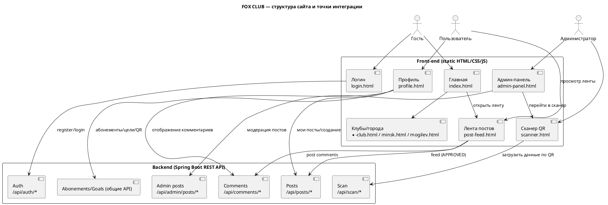

# Структура сайта FOX CLUB

Ниже описана структура фронтенда (HTML-страницы во `src/main/resources/static/`) и основные сценарии взаимодействия с backend API.

---

## 1) Страницы (UI)

### Публичные страницы
- **`index.html`** — главная (hero, информация о клубе, список клубов, цены, лента «Наши посты»).
- **`kupali-club.html` / `dolgobrodskaya-club.html` / `grushevskaya-club.html` / `kazinca-club.html` / `shmidta-club.html` / `minsk.html` / `mogilev.html`** — страницы конкретного клуба/города.
- **`login.html`** — вход/регистрация.

### Страницы после входа (основной пользователь)
- **`profile.html`** — личный кабинет:
  - мои абонементы
  - мои посты (создание + просмотр)
  - мои цели (включая модальные окна и возможные AI-рекомендации)
  - личный QR

### Страницы администратора
- **`admin-panel.html`** — админ-панель (таблица данных, CRUD/модальные окна, кнопки навигации, доступно только для admin).
- **`scanner.html`** — QR-сканер (находит и отображает данные по QR-коду, позволяет редактировать/удалять абонементы).

### Контент
- **`post-feed.html`** — лента постов (пагинация, модальные окна: комментарии, фото в lightbox и т.п.).

---

## 2) Основные сущности доменной модели (backend)

- **Пользователь** (`User`)
- **Абонемент** (`Abonement`) и **купленный абонемент** (`PurchasedAbonement`)
- **Клуб** (`Club`)
- **Цель** (`Goal`)
- **Пост** (`Post`), **изображения поста** (`PostImage`), **статус поста** (`PostStatus`: `MODERATION`, `APPROVED`)
- **Комментарий** (`Comment`)

---

## 3) Интеграции UI ↔ API (сценарии)

### 3.1 Авторизация
- `POST /api/auth/register`
- `POST /api/auth/login`

### 3.2 Посты и комментарии
- `POST /api/posts` (multipart: `text`, `images[]`, `userId`)
- `GET /api/posts/feed?page=&size=` — лента: только `APPROVED`
- `GET /api/posts/user/{userId}` — мои посты ( `MODERATION` + `APPROVED` )
- `POST /api/comments`
- `GET /api/comments/post/{postId}`

### 3.3 Модерация (админ)
- `GET /api/admin/posts`
- `PUT /api/admin/posts/{id}/moderate` — смена статуса поста

### 3.4 QR-сканирование
- `GET/POST /api/scan/...` — обработка QR-данных (в проекте реализована отдача данных по QR и последующий UI для редактирования/удаления).

---

## 4) Диаграмма структуры сайта (PlantUML)

Ниже — диаграмма связей страниц и их роли. Она описывает именно UI-структуру и типичные сценарии взаимодействия.

---

## 5) Примечания по реализации

- Фронтенд хранится в `src/main/resources/static/` и отдаётся Spring напрямую.
- Статусы постов используются для модерации: **в общую ленту попадают только `APPROVED`**.
- QR-сканер динамически вызывает backend по найденному коду и показывает результат (пользователь/абонемент), после чего позволяет администратору редактировать/удалять.

